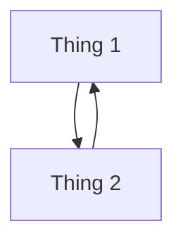

# Interest Meeting

# Club Structure
- Meetings are now Tuesdays at 5:00pm (potentially Wednesday instead)
- Club is now composed of 3 smaller clubs (programming, cybersecurity, competitive programming)
- Need for treasurer, backup SGA representative, and leader for programming and competitive programming subclubs (freshmen welcome!)
- Every week, the main club will focus on one of the three subclubs
- The last week of every month is reserved for social events (with the HPU Minds club)
- Added Python support to better integrate with the department and be more welcoming for freshmen

# Subclubs
Subclubs are exactly what they sound like: smaller clubs under the C.O.D.E. Club 

## The Cybersecurity Club
Leader: Reilly.

- Resources:

## The Competitive Programming Club
Leader: None (Ally?).

Resources: [ctftools](https://github.com/zardus/ctf-tools), [The Book of Secret Knowledge](https://github.com/trimstray/the-book-of-secret-knowledge), [National Cyber League (NCL)](https://nationalcyberleague.org/), [HackTheBox](https://www.hackthebox.com/hacker/ctf)

## The Programming Club
Leader: None (fallback: Ethan).

Resouces:

## HPU Minds
(Provided by Ash)

# For Showing Up
- `.vimrc` settings file
- Automatic spock login with SSHPass by typing `spock`

# Notes to Self
- Set up automatic attendence to send to SGA
