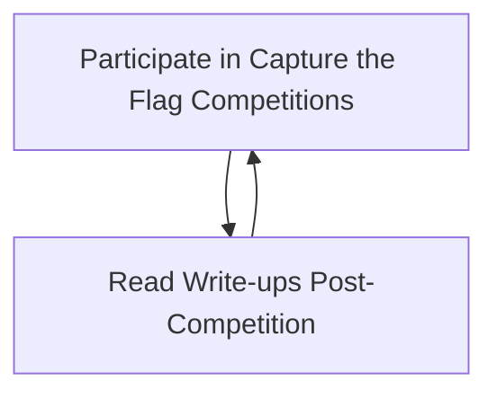
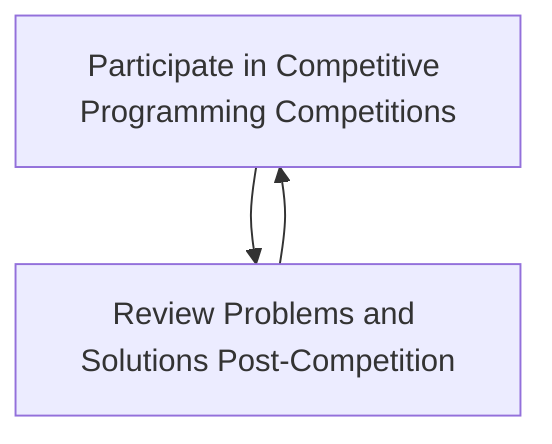

# Interest Meeting

# Club Structure
- Meetings are now Wednesdays at 5:00pm
- Club is now composed of 3 smaller clubs (programming, cybersecurity, competitive programming)
- Need for treasurer, backup SGA representative, and leader for programming and competitive programming subclubs (freshmen welcome!)
- Every week, the main club will focus on one of the three subclubs
- The last week of every month is reserved for social events (with the HPU Minds club)
- Added Python support to better integrate with the department and be more welcoming for freshmen

# Subclubs
Subclubs are exactly what they sound like: smaller, unofficial clubs under the C.O.D.E. Club. The three subclubs are cybersecurity, competitive programming, and
programming. Each week, the main club will focus on one of the three subclubs. HPU Minds is an independent club.

## The Cybersecurity Club
Leader: Reilly

- Heavily based around a feedback loop of competiting in cyber CTFs/Hackathons and then reviewing the write-ups
    1. Seasonal competitions (NCL, CSAW, PicoCTF)
    2. Year-round Practice Ranges (PicoCTF Range, NCL Gymnasium, CTFtime)
- Centralized cyber repository for storing write-ups and organizing notes

## The Competitive Programming Club
Leader: None (Ally?)

- Practice websites: Kattis and LeetCode
- 2-3 Weekly problems from Kattis, LeetCode, or other sites like CodeWars
- Attending college coding competiions like [ICPC](https://icpc.global/) (November!)
- Post-competition problem review
- Reference repository with common data structures and algorithms used in competitive programming

## The Programming Club
Leader: None (fallback: Ethan)

- Main focus is just building projects. That's it.

Resouces:

## HPU Minds
-HPU Minds meeting time is still being determined, will send out availability form to any interested CODE Club members afterwards
-This year we are splitting into two teams, one that will work with Matt Eaton on creating a robot and one software team that will work on data extraction and parsing from the headset
-Currently working on BCI interface project, but considering adding another project in spring
-Computer Science, Data Science, Computer Engineering, and Neuroscience majors preferred, but all majors welcome
-Flexible time commitment, but expected to contribute a minimum of 2 hours a week (fitting around student's schedule)
-Currently looking for Treasurer, Backup SGA Rep, and possible Social Media Manager

# For Showing Up
- Automatic spock login with SSHPass by typing `spock`

# Notes to Self
- Set up automatic attendence to send to SGA
