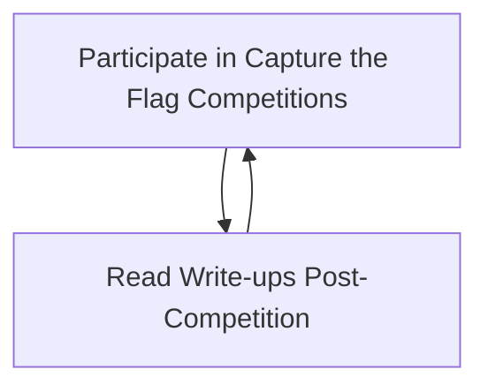
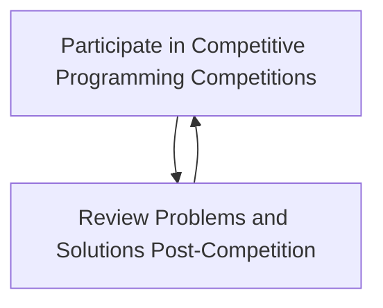

# Interest Meeting

# Club Structure
- Meetings are now Wednesdays at 5:00pm
- Club is now composed of 3 smaller clubs (programming, cybersecurity, competitive programming)
- Need for treasurer, backup SGA representative, and leader for programming and competitive programming subclubs (freshmen welcome!)
- Every week, the main club will focus on one of the three subclubs
- The last week of every month is reserved for social events (with the HPU Minds club)
- Added Python support to better integrate with the department and be more welcoming for freshmen

# Subclubs
Subclubs are exactly what they sound like: smaller clubs under the C.O.D.E. Club 

## The Cybersecurity Club
Leader: Reilly

- Heavily based around a feedback loop of competiting in cyber CTFs and then reviewing the write-ups
    1. Thig
    2. tew
- Other

## The Competitive Programming Club
Leader: None (Ally?).

- Practice websites: Kattis and LeetCode
- 2-3 Weekly problems from Kattis, LeetCode, or other sites like CodeWars
- Attending college coding competiions like [ICPC](https://icpc.global/) (November!)
- Post-competition problem review
- Reference repository with common data structures and algorithms used in competitive programming

## The Programming Club
Leader: None (fallback: Ethan).

Resouces:

## HPU Minds
(Provided by Ash)

# For Showing Up
- Automatic spock login with SSHPass by typing `spock`

# Notes to Self
- Set up automatic attendence to send to SGA
