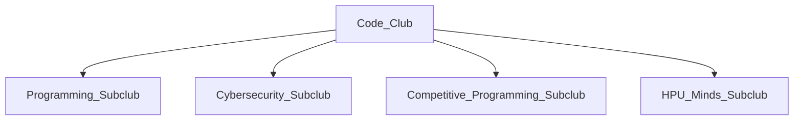

# Plans for the HPU Code Club

# Sort Out
- Delegate ACM representatives (president, vice president, treasurer)
- Choose leaders for C.O.D.E. club (president, vp, treasurer, SGA rep)
- Figure out what to do with cyber club
- Get interest meetings going (flyers!)

# Organization and Standardization
- Create a shared Google calendar for all code club (and subclub) members
- Formalize subclubs (pick leaders?)
- Pick a day of the week to meet
- Create a community discord server (done!)

# Subclubs
The computer science department has students with a diverse set of interests, which is reflected in the C.O.D.E. Club through _subclubs_. Subclubs are specialized
subgroups of the C.O.D.E. club that focus on a specific subject: programming, cybersecurity, competitive programming, et cetera. The goal of subclubs is to reduce the 
fractioning the students into small groups and prevent the clubs from competing for benefits like funding from student government. A subclub may or may not have a 
"leader" appointed to it to help direct the club.

# Weekly Meetings
Each week, the C.O.D.E. Club will focus their attention on one of the four subclubs: programming, cybersecurity, competitive programming, and then nothing. The
fourth week will always be casual, and will typically have some fun activity That week, any member of the club can create a presentation on that week's topic and 
present it. Often times, this will be one of the club leaders or president/vice president.
Presentations are *not* mandatory. If no one wants to present that week, then don't force it. The main goal of the C.O.D.E. Club is to provide a casual place where
people interested in computer science can hang out, even if they're not in the major.
