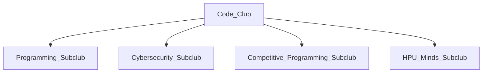

# Plans for the HPU Code Club

# Sort Out
- Delegate ACM representatives (president, vice president, treasurer)
- Choose leaders for C.O.D.E. club (president, vp, treasurer, SGA rep)
- Figure out what to do with cyber club

# Organization and Standardization
- Create a shared Google calendar for all code club (and subclub) members

# Subclubs
The computer science department has students with a diverse set of interests, which is reflected in the C.O.D.E. Club through _subclubs_. Subclubs are specialized
subgroups of the C.O.D.E. club that focus on a specific subject: programming, cybersecurity, competitive programming, et cetera. 

