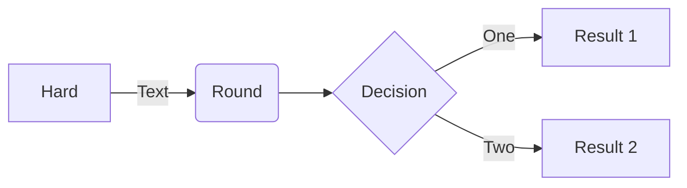

# Plans for the HPU Code Club

# Sort Out
- Delegate ACM representatives (president, vice president, treasurer)
- Choose leaders for C.O.D.E. club (president, vp, treasurer, SGA rep)
- Figure out what to do with cyber club

# Organization and Standardization
- Create a shared Google calendar for all code club (and subclub) members

# Subclubs
Subclubs are 

